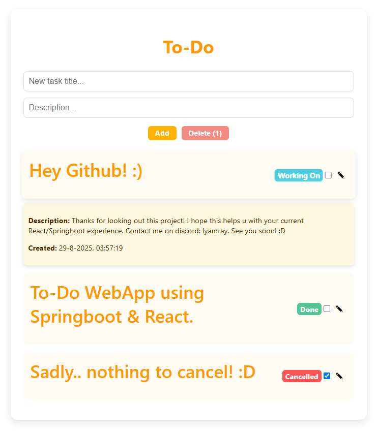
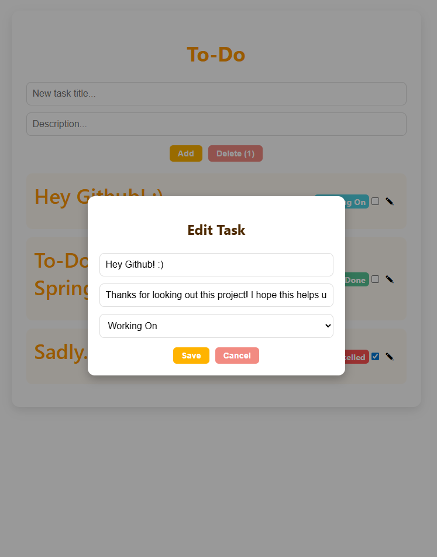
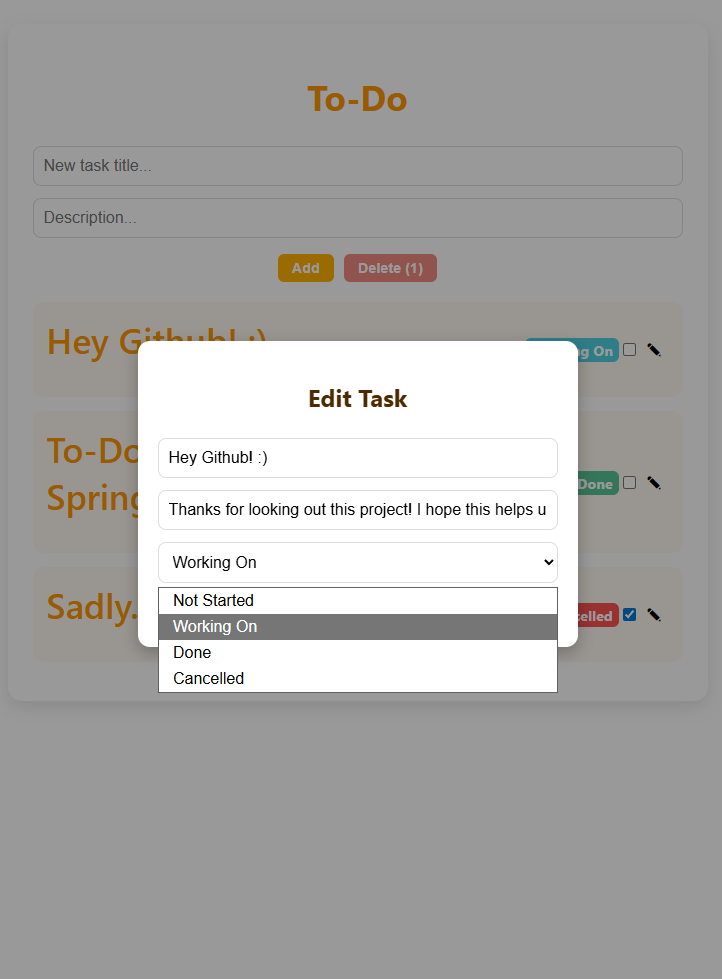

# To-Do WebApp

A full-stack To-Do application with a React frontend and a Spring Boot backend, using a custom SQLite-based database system.

### Click on the screenshot below to start the video!

## Some other pictures:

---

## Features

- Add, edit, and delete tasks.
- Track task status: Not Started, Working On, Done, Cancelled.
- Store task information in a custom SQLite database (todo.db).
- Interactive frontend built with React.
- Backend built with Spring Boot using a custom `Database` class for data persistence.

---

## Project Structure

demo/
- todo-frontend/       React frontend
    - public/
    - src/
    - package.json
    - .gitignore
- src/main/java/       Spring Boot backend
    - me/lyamray/todo/
        - controller/
        - database/
        - model/
        - service/
- data/                Database storage (todo.db)
- build.gradle
- settings.gradle
- gradlew
- gradlew.bat
- .gitignore

---

## Setup Instructions

### Backend (Spring Boot)

1. Make sure Java 21+ and Gradle are installed.
2. Navigate to the project root directory.
3. Run the backend with `./gradlew bootRun`.  
   The backend will start on http://localhost:8080.

### Frontend (React)

1. Navigate to the `todo-frontend` folder: `cd todo-frontend`
2. Install dependencies: `npm install`
3. Start the frontend: `npm start`  
   The React app will open on http://localhost:3000.

---

## Database

- The application uses a custom SQLite-based database located in `data/todo.db`.
- The database is managed via the `Database` class (`src/main/java/me/lyamray/todo/database/Database.java`), which supports:
    - Adding, updating, removing, and retrieving tasks.
    - Checking if tasks exist.
- No external SQL framework is required; everything is handled via the custom database class.

---

## Usage

- Open the frontend in a browser.
- Add a new task using the input fields.
- Click on tasks to edit or mark them as Done, Working On, Cancelled, or Not Started.
- Select tasks using checkboxes and click Delete to remove multiple tasks.
- All changes are persisted in `todo.db`.

---

## Notes

- `node_modules/` is ignored in git.
- Frontend and backend are separate but communicate via REST API endpoints (`/api/tasks`).

---

## License

MIT License
